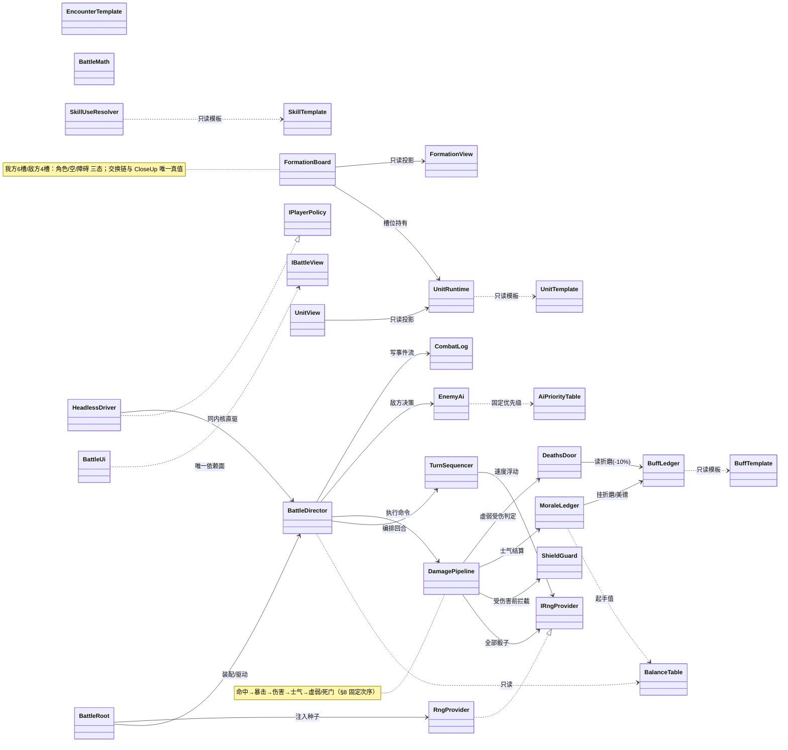
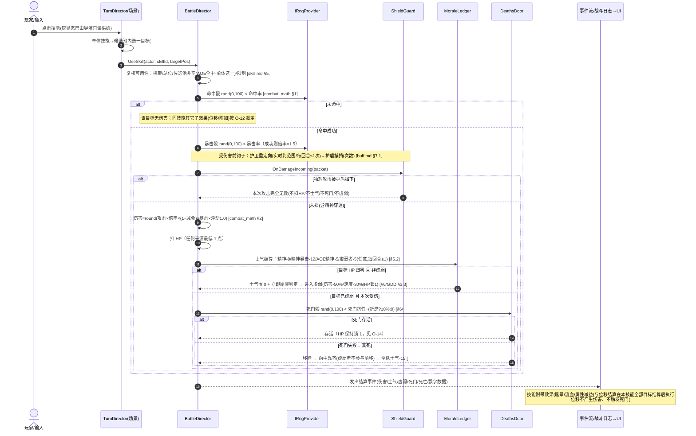
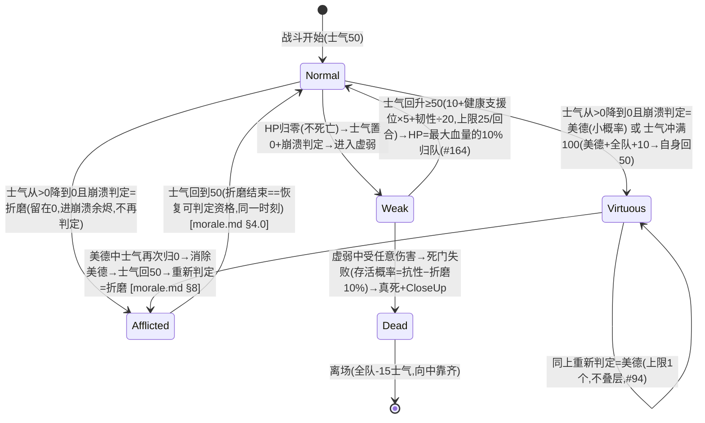
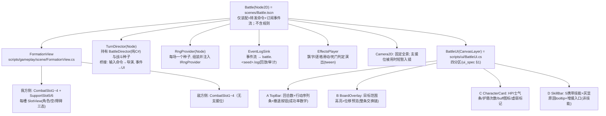

# 总体技术架构蓝图（blueprint.md）

> **编号**：ARCH-BP · **类型**：blueprint · **状态**：草案 v0.1（待架构师审校）
> **上游**：[设计] doc/GDD.md §1~§4 / §15；doc/modules/{combat_math,glossary,morale,formation,buff,skill,skill_data,character,enemy,ui_spec,verification,review}.md
> **决策引用**：#20~#24, #38, #41a/b, #56~#58, #68, #73~#80, #86~#90, #94~#98, #104~#105, #110~#118, #119~#126, #128~#133, #136~#165（正文逐条带出处）
> **依赖**：doc/architecture/_conventions.md（写作规范）；下游由 data_schema.md、tasks/*.md 承接（规划中，见 _conventions.md §2）
> **最近更新**：2026-09-09

**一句话定位**：本蓝图把「1 场 4v4 位置制回合战斗」切成五层——数据 → 确定性战斗内核 → 战斗导演 → 场景表现 → UI，并规定"实机战斗"与"headless Monte Carlo 模拟"驱动**同一个 BattleDirector 与同一个结算内核**（M6 ≥300 场验证的硬前提）；本文件只给结构、边界、契约与钩子，不给业务实现。

---

## 0. 阅读约定（写作时已遵守）

- 规则/数值/术语一律逐字对齐策划原文，出处写作 `[设计] 文件 §章节` 或决策 `#N`（= doc/state.md 决策表）。
- 冲突裁决按 README §6：`modules/` 为最细一层，优先于 `GDD.md`。
- 本文档只允许出现**接口签名 / 数据结构 / 目录与场景树 / 判定伪代码**，不含具体业务实现；字段级 schema 一律指向 data_schema.md（规划中）。
- 术语黑话与代码命名建议取自 glossary.md §9；新疑义按 _conventions.md §5 规则挂 **O-11+**（本文不直接改 open_issues.md，见 §13）。

---

## 1. 切片范围与工程约束

### 1.1 切片做（对应策划 README §2 M1~M6 + 架构侧 M0）

| 里程碑 | 内容 | 主要依据 |
|---|---|---|
| **M0 工程引导**（架构新增） | Godot 4.6 .NET/C# 工程 `darkest/`（res://）、测试工程、目录骨架、CI 冒烟 | 本蓝图 §2/§3 |
| M1 阵型骨架 | 6+4 槽位、三态（角色/空/障碍）、逐级交换链、向中靠齐、边界硬墙、预置障碍 | formation.md |
| M2 结算核心 | 属性表、命中/暴击/双减免/附加概率/位移抗性、行动序列与破平局 | combat_math.md |
| M3 技能与角色 | 13 字段数据结构、36 我方 + 7 敌方技能、站位门槛/目标位/灰显 | skill.md / skill_data.md / character.md |
| M4 士气与生存 | 士气增减、崩溃判定、折磨/美德/余烬、虚弱、死门、死亡与靠齐 | morale.md / buff.md / GDD §3 |
| M5 敌人与 UI | 敌方固定优先级 AI、第 6 回合超时增援、9 条必显示（尤其位移预览） | enemy.md / ui_spec.md |
| M6 验收 | 设计意图核对 + Monte Carlo ≥300 场 + 系统触发 KPI + 手感人工评 | verification.md |

> M1+M2 是硬门槛（README §2）：本蓝图把 M2 的公式实现限定在确定性内核（§4/§8），M6 的全部随机模拟都建立在这层确定性之上。

### 1.2 切片不做（从 GDD §15 与 README §5 提炼）

| 不做 | 出处/决策 | 说明 |
|---|---|---|
| 长线远征循环（地图/资源/营地/回城养成） | GDD §15.1、#81 | 切片只验证 1 场战斗；架构上仅预留"长线接入点"（BattleResult 出口），不实现 |
| 招募 / 新兵池 / 复活 / 遗物传承 | GDD §15.1、#110~#113、#72、#75 | 切片内角色死亡即永久损失、无补充渠道；角色死亡**不结束战斗**（§3.5 失败条件才结束本场），战后无继承系统 |
| 角色成长 / 升级 / 装备 / 固有特质 | GDD §15.1、#33、#150 | 韧性/美德概率等先用角色固定值 |
| 存档读档 | GDD §15.1 | 单场不需要；复现/回放靠 §8 的 seed+命令流 |
| 敌人死亡补位型增援 | GDD §15.1、§1.5.2 | 与"超时增援"是两回事，切片**只做第 6 回合超时增援** |
| 敌人 AI 轻度随机 | GDD §15.1、#112 | 切片走**固定优先级**（enemy.md §5.4 的 15% 随机留数据开关，见 O-19） |
| 大型敌人占多格 / 敌人造障碍技能 | GDD §15.2、#53 | 障碍只用**关卡预置**（#39/#73/#77/#105） |
| 3~4 套敌方编成 | GDD §15.2、#106、#89 | 切片只做 1 套（近战×2 + 射手 + 施法者，2 前排 + 2 后排） |
| 驱散类技能 | GDD §15.2、buff.md §5.1 | 36 我方技能中一个都没有，只留接口与数据位 |
| 中毒 / 腐蚀等新伤害轴 | GDD §15.2、README §5 开放题 10（O-10） | 物理/精神两轴先跑通 |
| 伤害浮动 0.9~1.1 | GDD §15.2、combat_math §2.1/§9、O-01 | 默认关闭（=1.0），控制随机层数 |
| 满值美德随机 vs 玩家指定 | README §5 开放题 9（O-09） | 现按 #55「随机抽取」实现，界面不提供指定 |
| 障碍挡远程 / 计入胜利条件 | GDD §1.1 `[待确认]`、O-08 | 切片按"障碍完全当敌人处理"落地（#73/#77/#105），远程不判定阻挡，见 §13 O-08 联动 |
| 立绘 / 动画 / 特效 / 音效 / 完整 UI 美术 | GDD §15.3 | 色块 + 图标 + 飘字替代；UI 按 ui_spec §8 MVP 清单 |

### 1.3 硬性工程约束

- 引擎 **Godot 4.6 (.NET/C#)**；工程根 **`darkest/`** = `res://`；C# 类型 PascalCase、文件/资源 snake_case、配置字段名以 data_schema.md 为准（_conventions.md §3）。
- **确定性铁律**：战斗规则/数值/随机全部收进"引擎无关纯 C#"内核（§4/§8）；场景与 UI 只做输入翻译、投影与演出。
- **不做清单为"不做"，遇到链路必需项先回问策划，不得自行加**（GDD §15 提示）。

---

## 2. 技术选型与理由

| 选型 | 理由（含出处） | 备注 |
|---|---|---|
| **C# / .NET**（Godot 4.6 .NET 版） | 与"确定性内核 + headless 模拟 + 单测复算"强匹配：C# 便于把结算做成纯类库并脱离场景树单测（verification §2 由实现方跑 Monte Carlo，README §6-7）；类型安全支撑 13 字段技能/多 buff 强类型绑定 | 与 GDScript 相比更适合 M6 的长跑模拟与公式复算 |
| **JSON（res://data/）→ 强类型绑定（resources/*.tres）→ 只读 C# record**，而非手工节点配置 | ① 43 条技能、3 折磨/4 美德、士气增减表全是"表"，配置驱动才能与策划表一一对应并做导入校验（buff.md §1「加 buff 只写配置」的用户硬要求）；② Monte Carlo 需要"改起手值不改代码"（README §4「数值不当即改」）；③ 手工把数值填进场景节点会让数据/规则/表现三者焊死，headless 模拟拿不到干净数据 | 字段细节全部归 data_schema.md；本章只给管线（§7） |
| **战斗表现用 2D（Node2D/Control/CanvasLayer），不用物理引擎 / Jolt** | ① 战斗是"顺序 + 状态"博弈而非连续空间模拟：槽位/交换链是**离散索引**，没有刚体运动学语义（formation.md §2）；② 物理步进（tick/浮点/约束求解）会引入不确定性，与 §8 确定性铁律直接冲突；③ 位移"演出"是沿交换链的 tween 滑动（ui_spec §6），属表现层，不需要碰撞 | project.godot 建议（仅建议，不改代码）：不挂任何 PhysicsBody/Area/CollisionShape；留空物理默认层；主场景指向 `scenes/Battle.tscn`（M0 后）；渲染用 2D 最小管线，可考虑 `renderer/rendering_method` 保守档以覆盖老显卡 |
| **渲染与画面最小集** | 立绘/动画/特效不做（GDD §15.3）：色块表示单位、图标表示状态、飘字表示数值；镜头固定全景 + 单位高亮（ui_spec §9 建议）；支援位被使用/被攻击时镜头短暂移过去（GDD §1.1/§1.4） | 能分辨位置、士气、技能可用性、位移预览即可（ui_spec §8 MVP） |
| **项目骨架一次搭对**（M0） | Godot 4.6 .NET 的解决方案/导入/测试三件套若不先冒烟，M1 之后每层都踩一遍工具链坑 | 见 §3 目录与 §10 测试钩子 |

> ⚠️ 红线：本切片**禁止用物理体表达单位位置**。单位位置 = 槽位索引 + 阵营 + 状态，唯一真值在确定性内核的 FormationBoard 里（§4/§8）。

---

## 3. res:// 工程目录结构（= `darkest/`）

顶层只有 _conventions.md §3 允许的 6 个；下列为蓝图细化（新增子目录须回写本蓝图）。每项给一句话职责。

```
darkest/  (= res://)
├── project.godot
├── Darkest.sln / Darkest.csproj / Darkest.Tests.csproj   # 测试工程（M0）
│
├── scenes/                            # 场景与预制：*.tscn，只做"装配 + 转发"，不含战斗规则
│   └── battle/
│       ├── Battle.tscn                # 主战斗场景（根节点见 §5d SceneTree）
│       └── prefabs/                   # SlotView / UnitView / 飘字 / 死门判定弹窗 等预制
│
├── scripts/
│   ├── core/                          # 确定性内核·基础设施（纯 C#，零 `using Godot`）
│   │   ├── rng/                       # IRngProvider / RngProvider（固定种子、抽取审计）
│   │   ├── math/                      # BattleMath：combat_math 公式纯函数库
│   │   ├── events/                    # BattleEvent 类型族 + CombatLog（回放/统计单一数据源）
│   │   └── contracts/                 # §9 全部接口声明 + BattleCommand 等命令 record
│   │
│   ├── gameplay/
│   │   ├── sim/                       # 战斗领域内核（纯 C#，零 Godot）＝结算引擎
│   │   │   ├── board/                 # FormationBoard / UnitRuntime / 槽位三态 / 交换链 / CloseUp
│   │   │   ├── pipeline/              # DamagePipeline：命中→暴击→伤害→士气→虚弱/死门（§8 次序）
│   │   │   ├── morale/                # MoraleLedger（增减/崩溃判定/余烬/回升）
│   │   │   ├── survival/              # DeathsDoor / Weak 状态转移
│   │   │   ├── buffs/                 # BuffLedger / ShieldGuard（护盾次数/护卫重定向/钩子表）
│   │   │   ├── skill/                 # SkillUseResolver（skill.md §5 可用性顺序）
│   │   │   ├── turn/                  # TurnSequencer（速度浮动排序/破平局/眩晕跳过）
│   │   │   ├── enemy/                 # EnemyAi（固定优先级表读取 + 决策）
│   │   │   └── director/              # BattleDirector / IPlayerPolicy / BattleSession（§4 B3）
│   │   │
│   │   └── scene/                     # Godot 表现层（唯一允许 `using Godot` 的 gameplay 目录）
│   │       ├── BattleRoot.cs          # 战斗场景根脚本：装配、转发命令、订阅事件流
│   │       ├── FormationView.cs       # 阵型视图（6+4 槽渲染、位移预览高亮）
│   │       ├── SlotView.cs / UnitView.cs
│   │       ├── CameraRig.cs           # 固定全景 + 支援位入镜
│   │       └── EffectsPlayer.cs       # 飘字/逐格滑动/死亡演出（tween，仅表现）
│   │
│   ├── ui/                            # 界面逻辑（四分区控件 + 只读视图模型）
│   │   ├── BattleUi.cs                # 组装 A/B/C/D 四区（ui_spec §1）
│   │   ├── TopBar.cs / ActionOrderBar.cs / RetreatButton.cs
│   │   ├── SkillBar.cs / CharacterCard.cs / BoardOverlay.cs
│   │   └── IBattleView.cs             # UI 唯一依赖面：只读投影 + 命令门面
│   │
│   └── data/                          # 配置管线（加载/校验/绑定/运行时只读快照）
│       ├── Loaders.cs                 # JSON → 校验 → 绑定
│       ├── Validators.cs              # schema/引用/覆盖率校验（见 §7）
│       └── ImportTool.cs              # 编辑器导入：JSON → resources/*.tres
│
├── data/                              # 原始配置（JSON，来自策划表，起手值唯一落点；文件清单以 data_schema.md §1 为权威，共 7 个）
│   ├── units.json                     # 4 原型 + 3 敌人原型（data_schema §3.1）
│   ├── skills.json                    # 36 我方 + 7 敌方技能（13 字段，skill_data.md；data_schema §3.2）
│   ├── buff_defs.json                 # buff=修改器+钩子+生命周期（buff.md §1）；折磨3/美德/护盾/守护…（data_schema §3.4）
│   ├── morale_events.json             # §5.2 士气增减表全 14 行（data_schema §3.3）
│   ├── tuning.json                    # 系统级过程常量集中区 = README §4「数值总入口」镜像；参数覆盖集 override 入口（data_schema §3.7）
│   ├── formation.json                 # 槽位常量 + 初始编成 + 边界/障碍/靠齐规则标记（data_schema §3.6）
│   └── enemy_ai.json                  # 3 原型优先级表（enemy.md §5.4）+ 标记权重预留位（#96；data_schema §3.5）
│
├── resources/                         # 导入后的 Godot Resource（*.tres）：编辑器可视/可引用
│   ├── units/ skills/ buffs/ icons/ …  # 与 data/ 各 JSON 1:1 派生（子目录随 data/ 分片扩展），字段同 data_schema.md
│
└── tests/                             # 单测 + headless 模拟器（.NET 测试工程）
    ├── FormulaTests.cs                # 复算 combat_math §7.1 八个样例（§10）
    ├── DeterminismTests.cs            # 同 seed + 同命令流 → 事件日志逐字节一致
    ├── BoardTests.cs                  # 交换链/靠齐/边界（formation.md §6 验收）
    ├── ...KernelTests.cs              # 士气/死门/护盾护卫/技能可用性……
    └── MonteCarlo/
        ├── HeadlessDriver.cs          # 直驱 BattleDirector，无场景树（M6）
        ├── Policies.cs                # 半随机玩家策略 + 基线 AI（verification §2）
        └── Report.cs                  # 胜率/回合数/士气直方图/死门致死数/技能使用率
```

> 依赖纪律（代码级）：`scripts/core`、`scripts/gameplay/sim`、`scripts/data` 三个目录内**不得出现 `using Godot`**（CI 用静态检查强制）；`tests/` 直连 `sim`+`director` 编译，不经过场景树。

---

## 4. 总体分层与模块边界

五个逻辑边界，依赖方向自上而下单向；每个边界一句话职责 + 严禁反向依赖。

| 边界 | 物理位置 | 一句话职责 | 禁止（反向依赖） |
|---|---|---|---|
| **B1 Data 数据层** | `scripts/data` + `data/` + `resources/` | 把策划 JSON 校验、绑定为强类型只读数据，给内核提供"战斗期只读"的模板与起手值 | 不得引用任何战斗内核/表现类型；数据管线禁止写运行时状态 |
| **B2 Core 战斗内核（确定性）** | `scripts/core`（基础设施）+ `scripts/gameplay/sim`（域结算） | 全部规则/数值/状态机/随机/事件都在这层，纯 C# 零 Godot；同一份代码供实机与 headless 使用 | 内核不得反向依赖 B3~B5；`sim` 只能依赖 `core` 基础设施与 B1 只读数据；内核文件禁止 `using Godot` |
| **B3 BattleDirector 战斗导演** | `scripts/gameplay/sim/director` | 一场战斗的确定性编排：回合循环、命令执行、AI 决策注入、结算调度、事件流输出；**不是 Godot Node**，headless 可直驱 | 导演不得依赖场景/UI 类型；不得自己造随机（一律走注入的 IRngProvider） |
| **B4 Gameplay 表现层（Scene）** | `scripts/gameplay/scene` + `scenes/` | Godot 节点世界：装配、输入翻译成 BattleCommand、把事件流渲染成"逐格滑动/飘字/高亮/演出" | 表现层**不得实现任何战斗规则**（唯一事实在内核）；不得直接改内核状态，只能发命令 + 读只读投影 |
| **B5 UI** | `scripts/ui` | 四分区渲染 ui_spec 的 9 条必显示；悬停计算请求与技能选择都走 IBattleView 门面 | UI 不得触内核结算 API；不得持有可写引用 |

依赖简图：`B1 → B2 → B3 → B4 → B5`（箭头 = 依赖方向）；例外：`tests/` 从旁路直连 `B1/B2/B3`（headless 模拟是 M6 验收工具，不是产品层）。

边界要点：

- **B2 内部再分两层**：`core` = 通用设施（RNG/事件/纯公式），`sim` = 战斗领域。二者同属"确定性内核"这一逻辑边界，但 `sim` 只允许依赖 `core`。
- **B3 是"确定性 ↔ 表现"的唯一咽喉**：所有对局状态变更都从导演发出命令开始、以事件流结束；UI/实机/模拟三者只差"命令来源"不同。
- **铁律（反向依赖检查）**：出现 `scene → sim 写操作`、`ui → 内核结算`、`sim → Godot` 任一情形即架构违规，直接评审驳回。

---

## 5. Mermaid 图

### 5a. classDiagram — 核心系统/服务与接口（对齐 §4 五层）



### 5b. sequenceDiagram — 一次「选技能 → 命中 → 伤害 → 士气 → 死门/死亡」

次序严格按 combat_math.md §5.2「先伤害 → 再士气 → 再虚弱/死门」与 §6 流程；`[GDD §4]` 中的附加效果/位移不改变士气与死门次序（见 5b 尾部 Note 与 §8 管线）。



### 5c. stateDiagram — 单位状态机（主生命周期轴）

折磨/美德/护盾等 buff 与"虚弱"正交存在，由 IBuffLedger/状态标记承载，不并入本状态机（buff.md §1）。



> 状态说明：Normal=可行动且未进虚弱；Afflicted=折磨（恐惧/自私/失控，33% 概率触发对应结果，morale.md §4.1）；Virtuous=美德（切片做 勇猛+振奋，持续到战斗结束或士气再次归 0）；Weak=虚弱（可与 Afflicted/Virtuous 并存）；Dead=永久死亡。敌方单位无士气/虚弱/死门（enemy.md §1），不套本状态机。

### 5d. flowchart — Battle 主场景 SceneTree 节点树

命名遵循 glossary.md §9（CombatSlot/SupportSlot/CloseUp/SwapChain/Morale/…）；`TurnDirector`、`RngProvider` 为场景侧外壳，内核本体见 §4 B3/B2。



> 位移预览 = 内核同源 dry-run：UI 请求"预览 = 对当前只读快照跑一次同一内核的交换链计算"，保证"预览结果"与"确认后结算"永远一致（ui_spec 必显示 #6）。

---

## 6. 事件与消息流约定

### 6.1 三种消息机制的边界

| 机制 | 用在哪 | 为什么 | 反例（禁止） |
|---|---|---|---|
| **直接方法调用** | 内核内部（B2/B3）：DamagePipeline→MoraleLedger/DeathsDoor… | 调用即结算顺序，天然确定、可断点、可复算；内核不加订阅解耦（避免订阅顺序破坏确定性） | 内核里用事件把士气/死门串成订阅链 |
| **C# 类型化事件/观察者** | B3 导演 → B4 表现层的一条**单向事件流**（BattleEventStream / CombatLog） | 事件流 = 结算事实的顺序真值，同时是 UI 刷新源、战斗日志源、回放录制源 | 表现层反向订阅或篡改事件流 |
| **Godot Signal** | 场景树内节点间"表现侧"通知：演出完成→放行下一条、tween 结束、镜头请求、输入回调 | Signal 是 Godot 节点的原生解耦，限于表现层内部 | 把战斗规则事实经 Signal 广播出内核 |
| **直接引用（组装根/服务定位）** | BattleRoot 持有 TurnDirector/RngProvider；TurnDirector 持有 BattleDirector 实例 | 组合根只有少数几个，直接引用最直白；内核对象全部由组合根显式注入 | UI 直接握内核对象引用 |

### 6.2 士气增减 / 战斗日志 / UI 刷新的解耦

- **士气唯一写入口** = 内核 DamagePipeline 里的 `MoraleLedger.Apply(unit, delta, source)`（增减表 [设计] combat_math §5.2 / morale.md §2，数值逐字一致）。UI、飘字、日志都只**订阅 MoraleChanged 事件**；禁止 UI 直接调士气 API。
- **战斗日志 = 事件流本身**：CombatLog 记录不可变事件（含 RNG 抽取序号与值，§8），同时服务：UI 结算反馈、回放复现、Monte Carlo 统计（verification §3 全部 KPI 都从日志统计）。一处写入、处处只读。
- **UI 刷新**：不做"逐字段命令式更新"，而是"收到一帧事件批 → 重算只读投影（IBattleView）→ 分区控件重绘"。这样 9 条必显示（ui_spec §2）与状态显示规格（ui_spec §5）都由同一投影驱动，不会各控件状态漂移。

### 6.3 禁止"全局事件总线滥用"的判断规则（四问）

1. **是不是规则事实？** 是 → 必须走导演→表现层的事件流（BattleEventStream），不得上全局总线；只有**生命周期通知**（战斗开始/结束/暂停）与**纯表现通知**（演出完成）允许走总线。
2. **订阅者需要理解内核次序吗？** 需要（如行动序列划掉、同回合多目标死亡逐格演出）→ 禁止上无序总线，改订阅有序事件流。
3. **会出现双向依赖吗？** 会 → 事件解耦解决不了，改为接口注入/直接调用。
4. **谁写入？** 每个事件类型必须有唯一 owner 写入者；出现"两个地方都能写同一事件"即违规。

---

## 7. 数据驱动管线（概览）

字段级对照全部归 data_schema.md（规划中，本蓝图不重复 43 技能/士气表字段）；这里只定管线形状与"起手值如何集中可改"。

```
[策划表] ── 转写 ──▶ res://data/*.json（起手值唯一落点, §3 文件清单）
                        │
                        ▼ scripts/data（EditorImportTool, 构建期/导入期）
          校验：schema 合法 / ID 唯一 / 引用完整(技能↔buff↔士气常量) / 覆盖率规则
                （character.md §2: 每角色每位置≥1 可用技能——skill_data §6 已给覆盖校验表；README M3 判据≥2）
                校验失败 → 报错阻断启动，绝不放行脏数据进战斗
                        │
                        ▼
        resources/*.tres（Godot Resource 强类型绑定, 编辑器可视/可引用/可改图）
                        │
                        ▼ scripts/data Loaders
        C# 强类型 record 快照（UnitTemplate/SkillTemplate/BuffTemplate/EncounterTemplate/BalanceTable…）
                        │
                        ▼ 战斗开始（BattleSession 构建）
        运行时模板【只读】：UnitRuntime 由模板 Clone，战斗中绝不在模板上写回
```

**起手值集中可改（支撑 Monte Carlo 迭代）**：

- 所有公式常量/士气增减值/回升参数/增援回合/浮动区间等集中进 `data/tuning.json`（代码内唯一读取点 = BattleMath 与各 Ledger 的构造参数），镜像 README §4「数值总入口」。
- `BalanceTable` 支持"参数覆盖集"注入（`override: {key, value}`），Monte Carlo harness 以命令行给覆盖集跑一整批（verification §2 反推规则：胜率 <40% 上调我方/下调敌方，>70% 反之，回合 <6/>18 调伤害血量）。
- 违反点自查：任何"拍死在内核代码里、脱离 tuning.json 的起手值"都是架构违规（README §4「数值不当即改」、README §6-5）。

---

## 8. 确定性设计

### 8.1 铁律与结构

- **每场战斗一个种子**：`BattleSession(seed)`；同一 seed + 同一命令序列 ⇒ 逐位相同的结果与事件日志（回放/复现 = seed + 命令流，实机与 headless 通用）。
- **唯一随机出口**：所有骰子经 `IRngProvider`；抽取自带单调序号（DrawCount），每一条抽取都写进 CombatLog（数值 + 序号），使日志可重放、可审计"谁消耗了随机"。
- **内核零 `using Godot`**：无物理、无浮点时间依赖、无 Godot.RandomNumberGenerator；顺序容器遍历顺序固定（如槽位编号升序），杜绝字典/哈希序漂移。
- **半随机玩家策略的随机也走同一 IRngProvider、固定抽取时机**（行动选择阶段先抽、结算阶段后抽），保证整场命令流可复现；模拟实验粒度=每场一个显式 seed（`--seed N`）。
- **随机层一律落在内核固定调用点**：combat_math §9 清点的 9 层逐层对应一个调用点（下表）；实现后任何新增骰子必须走 DamagePipeline/对应 Ledger 的固定调用点并回填本表，否则判为架构违规。

### 8.2 9 层随机 → 内核调用点映射（[设计] combat_math §9）

| 层 | 可规划性(原文) | 内核调用点 | 判定式（逐字） |
|---|---|---|---|
| 命中 | ✅ 可规划 | DamagePipeline 命中步 | `rand(0,100) < 命中率`（§1） |
| 暴击 | ✅ 可规划 | DamagePipeline 暴击步 | `rand(0,100) < 暴击率`（§2，倍率 1.5） |
| 附加效果触发 | ✅ 可规划 | 附加效果判定（§4） | `rand(0,100) < 技能概率×(1−目标抗性)` |
| 位移过抗性 | ✅ 可规划 | 位移结算步（§3） | `rand(0,100) >= 目标位移抗性` 即成功 |
| 死门判定 | ✅ 可规划 | DeathsDoor.Roll（§6） | `rand(0,100) < 存活概率`（抗性 − 折磨 10%） |
| 崩溃判定(折磨/美德) | ⚠️ 半可规划 | MoraleLedger.RollCollapse | 美德率 = 10% + 韧性÷2（#56/#68） |
| 速度浮动 0~10% | ⚠️ 半可规划 | TurnSequencer.BuildRoundOrder（每回合重掷，#163） | `实际速度 = 基础速度×(1 + 0~10% 随机)` |
| 撤退判定 | ⚠️ 半可规划 | 撤退结算（公式未定，O-11） | 混合式：速度对比定基础成功率 + 随机（±10% 建议内，#46/#126） |
| 折磨触发 33% | ❌ 不可规划 | 折磨状态钩子（恐惧/自私/失控，#57） | 每次对应动作按 33% 触发 |

> 伤害浮动默认关闭（浮动=1.0），若日后开启（O-01）将成为第 10 个调用点，需在 DamagePipeline 伤害步加"一次"抽取并回填本表。
> 另注意：敌方"超时增援"若按 GDD §1.5.2「增援强度随机」引入随机抽取，同样必须落在内核固定调用点并走 IRngProvider（切片最小实现见 O-20）。

### 8.3 headless 与实机共用同一结算内核（M6 硬前提）

```
实机:   输入 →(BattleCommand)→ BattleDirector(内核) → 事件流 → 表现层演出
Headless: IPlayerPolicy/基线AI →(BattleCommand)→ BattleDirector(内核) → 事件流 → 统计/日志
                                        ▲ 同一个类、同一对象图、同一份 JSON 数据
```

- BattleDirector 不引用 Godot 类型 → `tests/MonteCarlo/HeadlessDriver.cs` 直接 new 并驱动，无需场景树/窗口。
- M6 判据（verification §2/§3）所需的全部日志字段（胜率/平均回合/各角色平均输出/死门致死数/士气分布直方图/技能使用率/系统触发 KPI）全部来自内核事件流，与实机演出零耦合。
- 一致性验收：同 seed 同命令流，实机回放与 headless 的事件日志必须逐事件一致（§10 的"镜像测试"）。

---

## 9. 强类型契约草案（接口签名；禁止写业务实现）

> 仅签名 + 一条关键规则来源；实现归主程序。命名沿 glossary §9（SwapChain/CloseUp/Morale/Resilience/Virtue/Affliction/CollapseEmber/Weak/DeathsDoor/DisplaceResist/Shield/Guard）。

```csharp
// ---------------------------------------------------------------
// 9.1 阵型：槽位三态 + 逐级交换链 + 向中靠齐
// 关键规则：位移只经交换完成、不产生空位、撞障碍即交换、撞边界即失败(不动)
//          [formation.md §2/§3；GDD §1.3/#20/#21/#22/#78]
//          靠齐仅在死亡/离场瞬间触发一次；虚弱者不参与前移；全虚弱留空不补(#24/#114/#115)
// ---------------------------------------------------------------
public interface IFormation {
    FormationSide Side { get; }                       // Ally(6 槽：CombatSlot1~4+SupportSlot5~6) / Enemy(4 槽)
    SlotState GetSlot(int pos);                       // 三态：有角色/空/被障碍占据（#3、GDD §1.1）
    UnitId? UnitAt(int pos);
    IReadOnlyList<int> OccupiedPositions(bool includeObstacle = true);

    DisplaceResult TrySwapChain(UnitId mover, int fromPos, int toPos, int distance); // 逐级交换链
    IReadOnlyList<SlotChange> CloseUp(int fromPos);   // 向中靠齐（返回每个槽位变更，供演出）
    bool CanCloseUpIn(int dir);                       // 边界/硬墙查询（供位移预览 dry-run）
}

// ---------------------------------------------------------------
// 9.2 行动序列：速度排序 + 破平局 + 眩晕跳过
// 关键规则：实际速度=基础×(1+0~10%)每回合重掷(#163)；同速编号小者先动(#80)；
//          眩晕=跳过本次行动、状态随即结束(GDD §2.5)；行动序列条须显示本回合+下回合(ui_spec 必显示#1)
// ---------------------------------------------------------------
public interface ITurnSequencer {
    IReadOnlyList<ActorId> BuildRoundOrder(IRngProvider rng); // 每回合开始重掷并排序
    ActorId? NextActor();                                 // 依序出列；眩晕单位被跳过
    void OnRemoved(ActorId who);                          // 死亡/离场实时更新序列(ui_spec §7)
}

// ---------------------------------------------------------------
// 9.3 技能可用性判定
// 关键规则：判定顺序=①战前携带5个内 ②自身站位要求 ③目标位部分非空(全空灰显) ④使用限制(CD/每场次数)
//          [skill.md §5；GDD §4/#23]；灰显原因须给 UI tooltip(ui_spec §4/必显示#3)
//          目标数量=候选池派生（#178/#179，O-38）：单体/any_ally 池内选一、AOE 全中、双段同目标两段
// ---------------------------------------------------------------
public interface ISkillUseResolver {
    Availability Resolve(UnitId caster, SkillId skill, IFormation snapshot);
}
public enum AvailabilityReason { Ok, NotCarried, BadStance, NoTarget, OnCooldown, UsesExhausted }

// ---------------------------------------------------------------
// 9.4 士气台账
// 关键规则：范围 0~100、初始 50、钳制；只精神伤害降士气(-8/暴击-12/AOE精神-5)，物理不掉(#157)；
//          判定按事件触发(仅>0降到0)；崩溃后留在0=崩溃余烬，余烬中不再判定；折磨回50解脱==恢复判定资格
//          [morale.md §1/§4/§4.0/§8；combat_math §5.2]
// ---------------------------------------------------------------
public interface IMoraleLedger {
    int Morale(UnitId u);
    MoraleChange Apply(UnitId u, MoraleDelta d, MoraleSource src, IRngProvider rng); // 返回净变动+是否触发崩溃事件
    CollapseRoll RollCollapse(UnitId u, IRngProvider rng); // 折磨(33%)/美德(美德率=10%+韧性÷2)
    bool IsCollapseEmber(UnitId u);
    int SupportSlotRegen(UnitId u, IFormation f);          // 虚弱回升=10+健康支援位×5+韧性÷20，上限25(morale.md §9)
}

// ---------------------------------------------------------------
// 9.5 死门
// 关键规则：虚弱中受任意伤害即判；存活概率=死门抗性−(折磨?10%:0)；rand<存活概率则存活
//          [combat_math §6/#123]；伤害来源含直接攻击/流血/护卫替挡(buff.md §7.1)，位移不触发(#117)
// ---------------------------------------------------------------
public interface IDeathsDoor {
    DeathsDoorRoll Roll(UnitId u, IRngProvider rng); // 仅在 u 处于 Weak 且本次受伤时被调用
}

// ---------------------------------------------------------------
// 9.6 buff 台账
// 关键规则：buff=修改器+钩子+生命周期(buff.md §1/#90)；叠层：有时限刷新、无限时叠层上限2(#159)；美德上限1(#94)；
//          属性修正加法先于乘法(buff.md §3/#159)；驱散=1次1个/100%/仅负面(buff.md §5.1)；虚弱不可驱散
// ---------------------------------------------------------------
public interface IBuffLedger {
    void Add(UnitId u, BuffId id, UnitId? source);
    void Remove(UnitId u, BuffId id);
    bool Has(UnitId u, BuffId id);
    IReadOnlyList<BuffInstance> Buffs(UnitId u);
    StatBlock FinalStats(UnitId u);                       // (基础+Σ加法)×Π乘法
    IEnumerable<Hook> Hooks(UnitId u, HookTiming t);      // 回合开始/结束、行动前/后、受到伤害前/后、用技能前、被治疗/鼓舞前…
}

// ---------------------------------------------------------------
// 9.7 敌方 AI
// 关键规则：固定优先级表(每原型一张，enemy.md §5.4)是配置非逻辑；可用性判定与玩家一致(skill.md §5)；
//          #112 切片不做"少量随机"，15% 改次优先留数据开关(default off，O-19)；预留"标记权重"字段(#96)
// ---------------------------------------------------------------
public interface IEnemyAi {
    SkillChoice Choose(EnemyId e, BattleSnapshot s, IRngProvider rng); // 读 AiPriorityTable 决策
}

// ---------------------------------------------------------------
// 9.8 确定性 RNG（内核唯一随机出口）
// 关键规则：骰子一律 rand(0,100)、比较用<，小于判定值算成功(combat_math 通用约定)；一次一掷、顺序固定
// ---------------------------------------------------------------
public interface IRngProvider {
    double NextPercent();        // [0,100)
    int NextInt(int minInclusive, int maxExclusive);
    ulong DrawCount { get; }     // 抽取审计序号（写入 CombatLog）
}

// ---------------------------------------------------------------
// 9.9 护盾/护卫（受伤害前拦截）
// 关键规则：护盾=抵挡N次物理攻击、被挡完全无效(不扣HP/不死门/不虚弱)，AOE算1次攻击，流血/位移/自我伤害不消耗，
//          精神穿透(#156)；护卫=伤害重定向：结算时实时判范围、每回合最多重定向1次、重定向后再算保护者防御、
//          虚弱保护者替挨触发死门(#159)，只重定向物理(buff.md §7.1 第5条，未独立立策→O-05)
// ---------------------------------------------------------------
public interface IShieldGuard {
    InterceptResult OnDamageIncoming(DamagePacket dmg, IFormation f); // 返回：被挡/重定向后的最终承受者与包
}

// ---------------------------------------------------------------
// 9.10 模拟/实机共用的命令源（供 BattleDirector 与 headless 驱动）
// 关键规则：玩家半随机策略 + 基线 AI 对照(verification §2)；与实机 AI 同源(enemy.md §5.4)
//          目标选择=候选池内选一(#178)；SemiRandom 含换位增援(#177，缺此口径非验收口径)
// ---------------------------------------------------------------
public interface IPlayerPolicy {
    BattleCommand Choose(IPlayerSideView view, IRngProvider rng); // 合法技能+合法目标内决策
}
```

> 注：§9 清单覆盖任务要求的 9 个接口（IFormation / ITurnSequencer / ISkillUseResolver / IMoraleLedger / IDeathsDoor / IBuffLedger / IEnemyAi / IRngProvider / IShieldGuard），另附 IPlayerPolicy 作为 M6 模拟命令源。IBuffLedger 管"buff 数据与生命周期"，IShieldGuard 管"受到伤害前拦截裁决"，两者在 DamagePipeline 内先后协作。

---

## 10. 测试钩子与验收前置

| 验收项 | 钩子/做法 | 判定式（可测） |
|---|---|---|
| **公式单测可复算** | FormulaTests 直接用内核 BattleMath 复算 [设计] combat_math §7.1 八个样例 | 战士→近战小兵=9；军医→近战小兵=9；政委→远程射手=9；坦克→近战小兵=6；近战小兵→战士=9；近战小兵→坦克=9；远程射手→军医=10；施法者→战士(精神)=8；另覆盖钳制/下限/四舍五入/减免极值 |
| **确定性回放** | DeterminismTests：同 seed + 同命令流跑两遍 | 两份 CombatLog 事件（含 DrawCount 序列）完全一致 |
| **镜像测试（UI 与内核解耦判据）** | 实机战斗以"录制命令流"重放，与 headless 事件日志逐条比对 | 逐事件一致；UI/表现层代码零规则（CI 静态检查 `using Godot` 白名单：只允许 scripts/gameplay/scene 与 scripts/ui） |
| **Monte Carlo harness 接入点** | tests/MonteCarlo：HeadlessDriver + Policies（半随机/基线 AI），CLI `--seed --runs --override` | M6：≥300 场（200~500），胜率落 **40~70%**；平均回合 <6 或 >18 触发节奏告警（verification §2） |
| **系统触发 KPI** | 从事件流统计（verification §3） | 单场下限：士气触底≥1、虚弱≥1、死门判定≥3、撤退≥1(整场)、美德与折磨各≥1(整场)、位移实际使用≥2，全部"自然发生" |
| **手感 3 指标** | 人工打 ≥5 局填表（verification §4） | ①位置决策非显然 ②无单一无脑最优 ③单场 8~15 分钟；附加观察：撤退意义/AI 可预判/老虎机感 |
| **无软锁回归** | 回合状态机用例 | 撤退重试循环、全虚弱死循环、增援卡死、同回合多人死亡靠齐 均无（verification §5） |
| **数据启动门禁** | Validators 在导入期执行 | 校验失败即阻断，不允许"半份技能表"进战斗 |

> UI 与内核解耦的验收判据一句话：**删掉整个表现层与 UI，headless 仍能凭同一内核跑完并产出 M6 全部指标；加回表现层不改任何内核代码。**

---

## 11. 与策划文档的对应关系表（M0~M6）

| 里程碑 | 主要依据设计文件 | 蓝图章节 | 验收判据（一句话） |
|---|---|---|---|
| M0 工程引导 | _conventions.md §3；本蓝图 §2/§3 | §2、§3 | `darkest/` 在 Godot 4.6 .NET 可打开，测试工程跑通冒烟（含公式 1 例） |
| M1 阵型骨架 | formation.md / glossary §1 | §3、§4、§5a/5c/5d、§9.1 | 推一个人能看到整条交换链结果且不产生空位；死亡靠齐同一时刻完成（formation.md §6） |
| M2 结算核心 | combat_math.md | §4、§5b、§8、§9、§10 | 用文档 §7.1 试算样例能复算出同样数字 |
| M3 技能与角色 | skill.md / skill_data.md / character.md | §3、§7、§9.3 | 4 个角色在每个位置都至少 2 个可用技能（skill_data §6 覆盖校验表；灰显原因正确）；**目标=候选池选一（#178/#179，data_schema P11）** |
| M4 士气与生存 | morale.md / buff.md / GDD §3 | §5c、§6、§9.4~9.6 | 走通"受伤→虚弱→死门→死亡/靠齐"全链，且只被精神伤害掉士气（#157） |
| M5 敌人与 UI | enemy.md / ui_spec.md | §5d、§6、§9.7 | 玩家不看代码就能预判位移结果（位移预览=内核 dry-run）；9 条必显示齐全；**③b 目标点选（#178）与敌方 AI 单体选一（T-M5-02/06/07）** |
| M6 验收 | verification.md | §8、§10、§12 | 同内核 headless 跑 ≥300 场，胜率 40~70%、KPI 全达标、手感 3 指标过；**v0.44 目标语义改造后重新基线（旧 46% 作废，T-M6-08）** |

---

## 12. 技术风险与缓解（≤8 条）

| # | 风险（来源） | 影响 | 缓解 |
|---|---|---|---|
| 1 | **结算被表现层污染**（Godot 类型/演出代码混入规则路径） | 确定性失效、回放与 M6 模拟失真 | 三层目录零 `using Godot` + CI 静态检查；规则改动只能在 scripts/core|sim 内评审；镜像测试兜底（§10） |
| 2 | **9 层随机 × 士气级联导致平衡不可控**（README §7「老虎机感/士气级联」；review.md 失败点 1） | 胜率落不出 40~70%，或归因运气 | 每场单 seed 可复现；伤害浮动默认关闭（O-01）；调节顺序按 combat_math §5.2 附录；Monte Carlo 按 verification §2 反推规则迭代，不手调数值（README §6-5） |
| 3 | **UI 绕过导演直连内核**（§6.3 滥用场景） | 玩家操作与内核顺序失同步 → 不可回放、位移预览与结算不一致 | UI 只握 IBattleView 门面；所有写操作=命令对象由 BattleRoot→TurnDirector→BattleDirector 单向转交；预览=内核 dry-run（§5d） |
| 4 | **数据多源漂移**（review.md P0 教训：GDD 曾与决策表严重脱节；character.md 草案 vs skill_data.md 实值并存） | 导入脏数据、模拟结果不可信 | data/ JSON 为唯一落点 → 导入期 schema/引用/覆盖率校验失败即阻断；草案表不参与运行（O-15）；字段口径全部收进 data_schema.md |
| 5 | **时序软锁/死锁**（全员虚弱缩支援位、撤退重试、第 6 回合增援、行动序列中死亡改动后续） | 无软锁验收不过（verification §5） | 导演回合状态机为唯一推进者；回归用例覆盖 4 类软锁；事件流驱动可观测每一步 |
| 6 | **位置/预览两套坐标漂移**（位移预览只画"目标被推 1 格"而漏交换链连锁，ui_spec §6 警告） | 位移这一核心机制不可信 | 预览与结算共用内核 dry-run 输出；UI 只负责把同一份 SlotChange 序列画成逐格动画 |
| 7 | **Monte Carlo 性能不足**（300+ 场 × ~9 回合 × 全场景树跑） | M6 跑不完或抽样过少 | headless 直驱内核无 UI/无 tween；每场独立 seed 可并行分片；事件日志只保留统计所需字段的紧凑格式 |
| 8 | **工具链/版本耦合**（Godot 4.6 .NET 的 SDK 匹配、编辑器热重载、测试工程引用 Godot 程序集） | M1 后返工 | M0 先行冒烟（含一个真实公式单测）；内核文件靠"目录白名单"而非"程序集隔离"控制 Godot 引用；版本矩阵与踩坑记录写入 tasks/m0_bootstrap.md |

---

## 13. 开放问题（起草期提案，已并入 open_issues.md B 节）

> ⚠️ **编号迁移公告**：本节的 O-11~O-19 为蓝图起草期提案，权威编号已由架构师合并收口至
> `open_issues.md` B 节 **O-11~O-30**（下表沿用起草期编号，正文其余引用一律以 open_issues.md B 节为准）。
> 迁移对照：蓝图 `O-11→O-11`（撤退公式）；`O-12→O-12/13`（步骤次序→多段倍率）；`O-13→O-14`（士气聚合口径）；
> `O-14→O-15`（HP 算术）；`O-15→O-16`（数据口径）；`O-16→O-17`（状态互斥）；`O-17→O-18`（美德/折磨×虚弱）；
> `O-18→O-19`（AI 15% 随机）；`O-19→O-20`（超时增援）。

按 _conventions.md §5：O-01~O-10 已被策划 README §5 占用，以下 **O-11 起**为架构/实现新增疑问（起草期编号，仅供追溯）。

| 编号 | 描述 | 建议阻塞范围 |
|---|---|---|
| O-11 | **撤退成功率公式缺失**：GDD §3.6/#46 只定"混合式 = f(速度对比) + 随机（建议 ±10% 内）"，未给具体算式；而 ui_spec 必显示 #2 要求显示成功率数字、M6 需要确定性撤退判定（verification §3 撤退 KPI） | 阻塞 M5 撤退按钮数字与 M6 撤退 KPI；建议先落"可配置公式 + 默认示例实现"占位，正式公式【策划拍板】后回填 tuning.json |
| O-12 | **一次攻击/技能内部步骤次序未全定**：combat_math §5.2 只定"伤害→士气→虚弱/死门"；附加效果（眩晕/流血/减益）与位移结算的相对位置、AOE 多目标处理顺序、中途死亡从后续目标/靠齐中剔除的时机、未命中时同技能其它子效果是否照常，均未裁决 | 阻塞 AOE 与位移技能内核实现；蓝图 §5b/§8 已给"工作次序草案"（目标逐结算→士气→状态，效果与位移在技能全部目标后执行），待【策划拍板/实现裁定】固化进 tasks/m2 |
| O-13 | **士气团队性事件聚合口径**：AOE/多段伤害（如双连击 0.55×2）下，暴击+5、击杀+10、队友虚弱-8、队友死亡-15（combat_math §5.2 表）按"每次伤害实例"还是"每次技能动作"聚合未注明 | 影响士气分布直方图 KPI（verification §3）；建议先按"实例各自结算、全队性事件同动作内合并为一次"实现，Monte Carlo 校正 |
| O-14 | **虚弱者受伤害的 HP 算术**：combat_math §6 只说"HP 锁定 1"，受伤瞬间 HP 是否先扣到 0 再死门、存活时剩余伤害是否溢出，未写 | 阻塞 DeathsDoor/HP 记账实现；蓝图采用"虚弱中伤害不改变 HP(恒 1)，直接进入死门判定，存活留在 1、失败归 0 死亡"，需确认 |
| O-15 | **数据口径冲突源**：character.md §3~§6 技能草案表与 skill_data.md 已填实值并存（草案残留旧语义，如"铁壁=吸收固定伤害" vs #156 按次数）；另 README §2 M3 判据写"42 条技能数据"而 skill_data.md 实为 36+7=43 | 阻塞数据导入与覆盖校验；实现一律以 skill_data.md/combat_math 为准，README 的 42 疑笔误；导入校验断言技能数=43 并在 data_schema.md 落字段对照 |
| O-16 | **状态标记互斥表**（buff.md §8.1 仍开放）：眩晕+捆缚并存谁优先、捆缚持续时间（衍生自失控"到士气回 50"？）未裁决 | 阻塞状态机/IBuffLedger 的标记互斥实现；建议按 buff.md §8.1"后者覆盖前者（取较长者）"占位并挂拍板 |
| O-17 | **美德/折磨与虚弱正交闭环**：morale.md §8「美德中再次归 0 → 消除 → 回 50 → 重新判定」与"虚弱期士气回升同刻折磨解除"、buff 上限 1 的交叠场景未完整定义 | 阻塞 M4 状态机边界用例；建议先按 §5c 状态机 + 事件触发判定实现，把组合场景表列进 tasks/m4 |
| O-18 | **敌人 AI「15% 次优先随机」与 #112 冲突**：enemy.md §5.4 写了少量随机 15%，#112 定切片不做随机 | 不阻塞 M5：切片落地为固定优先级（纯确定性），15% 档留 AiPriorityTable 数据开关 default off；与 O-05（护卫是否只挡物理）同属"未立策可推翻"档 |
| O-19 | **超时增援"强度随机"无分布定义**：GDD §1.5.2/enemy.md §4 只写"随机强度、只填空位"，具体随机范围/单位表未给 | 阻塞增援数据的确定性实现；切片最小实现=从 3 个敌人原型按默认起手值生成、不走随机分布，待数值阶段补分布（随机若启用必须走 IRngProvider 固定调用点） |
